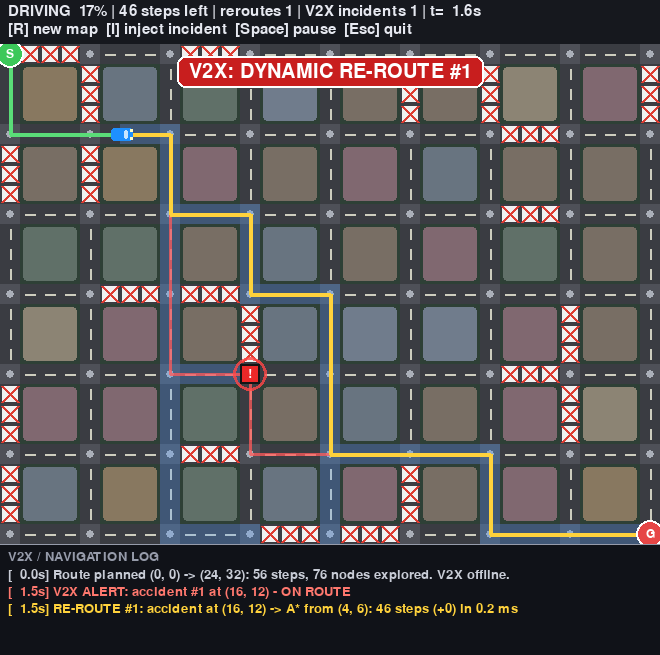
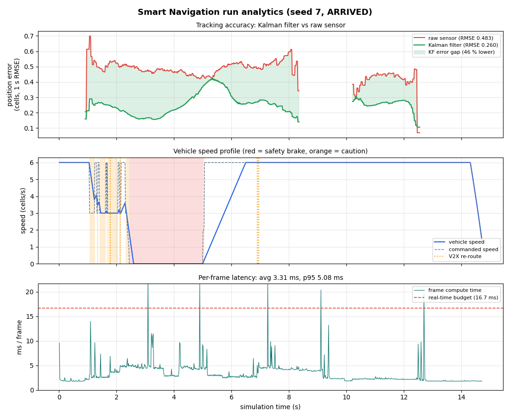
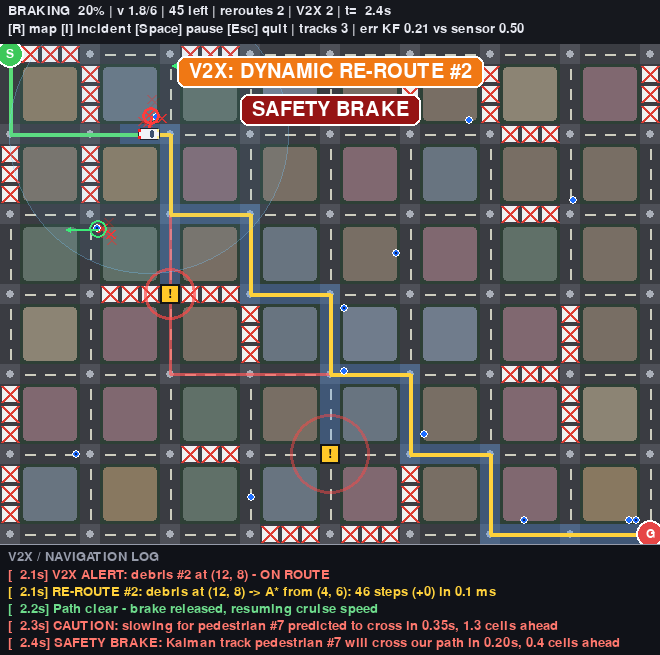

# Smart Navigation and Route Optimization System

A cloud-runnable autonomous-vehicle navigation simulator written in Python with
Pygame, NumPy and Matplotlib. A virtual car plans an optimal route across a city grid
with **A\***, re-plans mid-route around live **V2X** incident broadcasts, tracks moving
pedestrians and cyclists through a **noisy sensor** fused by **Kalman filters**, brakes
when a tracked obstacle is predicted to cross its path, and exports an **analytics
report** at the end of every run. Everything runs headless, so it works on machines
without a GPU or display.



| Phase | Delivered |
|---|---|
| 1 - Environment & core routing | Pygame city grid (roads, intersections, road works, start/goal), A* engine, vehicle traversal |
| 2 - V2X & dynamic re-routing | Incident broadcast network, instant mid-route A* re-planning, flashing closures, ghost routes, event log |
| 3 - Perception & sensor fusion | Moving pedestrians/cyclists, noisy camera/LiDAR model, 2D Kalman tracker, predictive safety brake |
| 4 - Analytics, hardening & packaging | Per-run metrics (latency, KF accuracy, energy, events), Markdown + chart export, safe-halt handling of lock-up cases |

## Installation

Requires Python 3.9+ (tested on 3.10). No GPU is needed.

```bash
git clone https://github.com/vineeth2323-code/major_1.git
cd major_1
python -m venv .venv
source .venv/bin/activate            # Windows: .venv\Scripts\activate
pip install -r requirements.txt      # runtime: pygame, numpy, matplotlib
pip install -r requirements-dev.txt  # + pytest, for the test suite
```

## Running

### Interactive window

```bash
python main.py                                   # random map
python main.py --seed 7 --obstacles 12           # reproducible map, more pedestrians
python main.py --random-endpoints --closure-rate 0.3
```

Keys: `R` new map, `I` drop an incident on the route, `X` close every road into the goal
(10 s), `O` make a pedestrian stand on the goal marker, `Space` pause, `Esc` quit.

### Headless (cloud / CI / no display)

```bash
# Full run with screenshot, route plot and analytics report
python main.py --headless --seed 7 --screenshot artifacts/final.png \
    --plot artifacts/route.png --report-dir artifacts/report

# Lock-up edge cases: both end in a logged SAFE HALT instead of hanging
python main.py --headless --seed 7 --edge-case isolate-goal --report-dir artifacts/isolated
python main.py --headless --seed 7 --edge-case occupy-goal  --report-dir artifacts/occupied

# Comparisons
python main.py --headless --seed 7 --no-brake        # track obstacles but never brake
python main.py --headless --seed 7 --no-perception   # Phase 2 behaviour only
python main.py --headless --seed 7 --no-v2x          # static map, no incidents
```

Headless runs use SDL's `dummy` video driver and a fixed 60 FPS timestep, and stop when
the mission is over (arrived, or held in a safe halt) or after `--frames N`. The last
lines printed summarise the run, e.g.
`outcome=ARRIVED avg_frame_ms=... energy_wh=... efficiency=...%`.

### Command-line options

| Group | Options |
|---|---|
| Map | `--seed`, `--blocks-x 8`, `--blocks-y 6`, `--block-size 4`, `--cell-size 20`, `--closure-rate 0.2`, `--random-endpoints` |
| Vehicle | `--speed 6` (cells/s) |
| V2X | `--no-v2x`, `--incident-rate 0.3` (per s), `--incident-duration 12 25` (`0 0` = permanent), `--path-bias 0.6`, `--max-incidents 6` |
| Perception | `--obstacles 8`, `--sensor-noise 0.35` (cells), `--sensor-range 7`, `--no-brake`, `--no-perception` |
| Analytics & safety | `--report-dir DIR`, `--max-time 300` (watchdog, s), `--edge-case {isolate-goal,occupy-goal}` |
| Output | `--headless`, `--frames N`, `--exit-on-arrival`, `--screenshot PNG`, `--plot PNG`, `--hide-explored`, `--quiet` |

### Using the modules directly

```python
from smart_nav.environment import CityGrid
from smart_nav.routing import find_route
from smart_nav.simulation import Simulation, SimulationConfig

city = CityGrid(blocks_x=8, blocks_y=6, block_size=4, closure_rate=0.2, seed=7)
route = find_route(city.passable, city.start, city.goal)       # A* on the occupancy grid
print(route.cost, len(route.explored))

sim = Simulation(SimulationConfig(seed=7, num_obstacles=12), headless=True)
result = sim.run(exit_on_arrival=True, render=False, report_dir="artifacts/report")
print(result.outcome, result.reroutes, result.brake_events, result.kf_rmse, result.efficiency_pct)
sim.close()
```

## Architecture

```
               +-------------------+        incident / clear broadcasts
               |  V2XNetwork       |-----------------------------+
               |  (v2x_network.py) |                             |
               +-------------------+                             v
+-------------+    +-----------------+    +------------------+   +---------------------+
| CityGrid    |--->| A* router       |--->| Vehicle          |<--| Simulation loop     |
| (environ-   |    | (routing.py)    |    | (vehicle.py)     |   | (simulation.py)     |
|  ment.py)   |    +-----------------+    +------------------+   |  speed governor,    |
+-------------+                                  ^               |  safe-halt logic    |
      |                                          | speed limit   +---------------------+
      v                                          |                   |            |
+-------------+  noisy   +-----------+  tracks  +----------------+   v            v
| Obstacle-   |--------->| Kalman    |--------->| Threat         |  RunAnalytics  CityRenderer
| Field +     | readings | tracker   |          | assessment     |  (analytics.py)(Pygame)
| NoisySensor |          | (KF2D)    |          | (perception.py)|
+-------------+          +-----------+          +----------------+
```

Each frame: V2X update -> perception (obstacles move, sensor scans, Kalman predict/update,
threat check) -> safe-halt / watchdog checks -> speed governor -> vehicle motion ->
collision accounting -> analytics sample -> render.

### How the pieces fit together

- **Sensors.** `NoisySensor` models a 20 Hz camera/LiDAR with a 7-cell range: every
  detection gets independent Gaussian X/Y noise (std 0.35 cells) and 5% are dropped. It is
  deliberately imperfect so downstream estimation has something to fix.
- **Deep-learning concepts.** This project does not train or run a neural network. In a real
  stack a learned detector (e.g. a CNN/transformer object detector on camera or LiDAR data)
  turns raw pixels/points into labelled object detections with position noise and misses.
  `NoisySensor` stands in for that detector's *output*: labelled detections with noise and
  dropouts. A trained model could replace it behind the same `Detection` interface without
  touching the tracker, planner or controller.
- **Kalman filtering.** `KalmanFilter2D` is a constant-velocity filter, state
  `[row, col, v_row, v_col]`, measuring position only. A chi-square innovation gate notices
  when a pedestrian turns, stops or reverses and widens the velocity uncertainty so the
  filter re-converges quickly. `MultiObjectTracker` keeps one filter per obstacle
  (detections carry the obstacle id, so data association is assumed solved).
  `assess_threats` projects each track 1.5 s ahead and checks it against the car's
  footprint along its upcoming route; the car slows (`SLOW`) or stops 0.5 cells short
  (`BRAKE`) and resumes once the path is clear.
- **V2X networks.** `V2XNetwork` broadcasts accidents, construction and debris as they
  happen and when they clear. Incidents on the remaining route trigger an immediate A*
  re-plan from the car's next cell; clearances trigger an opportunistic re-plan that is
  adopted only if shorter.
- **Routing.** A* on the 4-connected drivable grid with unit costs and a Manhattan
  heuristic (admissible, so routes are optimal); re-plans take well under a millisecond.

### Analytics (`analytics.py`)

`RunAnalytics` samples every frame and, with `--report-dir`, writes:

- `performance_report.md`: run parameters and outcome; frame latency (average, median,
  95th percentile, peak, % of frames over the 16.7 ms 60 FPS budget, split into simulation
  step vs rendering); Kalman vs raw-sensor RMSE overall and per 5 s interval; an energy
  model (1500 kg car, rolling resistance, aerodynamic drag, drivetrain losses, braking
  losses, idling) with Wh/km, litre-equivalent/100 km and an efficiency score against an
  ideal constant-cruise drive; counts of V2X incidents, re-routes, safety-brake
  activations, safe halts and collisions; and an event timeline.
- `analytics_summary.png`: rolling Kalman vs raw-sensor error with the gap shaded, the
  speed profile with brake/caution periods and re-route markers, and per-frame latency
  against the real-time budget.

An example from seed 7 is in [docs/performance_report.md](docs/performance_report.md):



### Safe halt (lock-up hardening)

The vehicle never loops forever or crashes when the goal can't be reached:

| Situation | Detection | Response |
|---|---|---|
| V2X closures isolate the goal | A* finds no route from the car's next cell | Stops at that cell, pulls over, logs `CRITICAL` + `SAFE HALT (goal isolated)`; retries A* every second and on every V2X clearance, resuming automatically |
| Obstacle standing on the goal marker | Stopped for `blocked_patience` (5 s) by a stationary track within 1 cell of the goal | Holds short of the goal, `SAFE HALT (goal occupied)`; resumes once the goal has been clear for 1 s |
| Stationary obstacle blocking the lane | Same, away from the goal | `SAFE HALT (path obstructed)`; resumes when clear |
| Runaway mission | Simulated time exceeds `max_sim_time` (default 300 s) | Watchdog brings the car to a stop, `SAFE HALT (watchdog timeout)` |

Headless runs end once a halt has lasted `halt_patience` (15 s) and report
`outcome=SAFE_HALT` with the reason, instead of hanging.

## Repository layout

```
main.py                  CLI entry point
smart_nav/
  environment.py         CityGrid (roads, intersections, closures, start/goal) + CityRenderer (Pygame)
  routing.py             Generic A* search + find_route() for occupancy grids
  v2x_network.py         V2XNetwork: incident alerts / clearances broadcast to subscribers
  perception.py          Moving obstacles, NoisySensor, KalmanFilter2D, tracker, threat assessment
  vehicle.py             Vehicle kinematics (accel/brake limits), route following, re-routing, drawing
  simulation.py          Main loop: wiring, speed governor, safe-halt handling, report export
  analytics.py           RunAnalytics: latency, tracking accuracy, energy model, Markdown/PNG export
  visualize.py           Static matplotlib route plot
tests/                   pytest suite (headless)
docs/                    Screenshots and an example performance report
```

## Visual legend

- Yellow line: remaining route; green: driven; blue cells: nodes A* expanded.
- Flashing red/yellow cells with a pulse ring: V2X incidents; fading red line: abandoned route.
- Blue dot: true obstacle position (dark centre = cyclist); red X's: noisy sensor readings;
  green ring + arrow: Kalman estimate and velocity (red when it is the threat); faint circle:
  sensor range.
- White car with brake lights; a magenta ring marks a pulled-over car in a safe halt.
- Banners: `V2X: DYNAMIC RE-ROUTE`, `CAUTION: SLOWING`, `SAFETY BRAKE`, `SAFE HALT`.



## Tests

```bash
python -m pytest          # full suite, headless (~3 min)
python -m pytest tests/test_edge_cases.py tests/test_analytics.py   # Phase 4 only
```

- `test_routing.py`: A* optimality vs BFS on random grids and Dijkstra on weighted graphs.
- `test_simulation.py`: map generation and connectivity, vehicle kinematics, headless rendering, end-to-end runs.
- `test_v2x.py`: broadcast/expiry/safety rules, mid-route blockage re-routing, high-incident stress runs.
- `test_perception.py`: sensor statistics, Kalman error well below raw sensor error, velocity
  convergence, threat geometry, a distracted pedestrian who is hit with the brake off and avoided
  with it on, and random multi-obstacle runs with zero collisions.
- `test_analytics.py`: energy model (cruise, braking, idling), RMSE over time, latency statistics,
  report/chart export from a real run, metric consistency, CLI export.
- `test_edge_cases.py`: isolated goal (halt, and recovery when closures clear), obstacle on the goal
  (halt, hold, recovery), watchdog, safe-halt rendering, and the CLI edge-case runs terminating.
